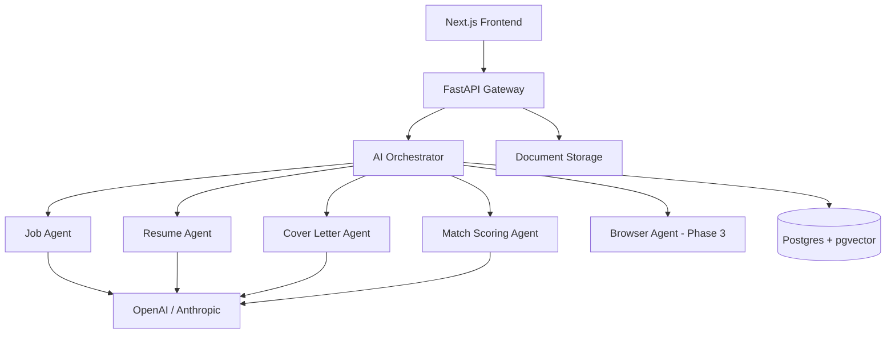

# Architecture

## High-Level Flow

## Phase 1 MVP Endpoints

| Method | Path | Description |
|--------|------|-------------|
| POST | `/api/jobs/analyze` | Extract structured job profile |
| POST | `/api/resumes/upload` | Upload PDF/text resume |
| POST | `/api/resumes/tailor` | Tailor resume to job |
| POST | `/api/cover-letters/generate` | Generate cover letter |
| POST | `/api/jobs/{id}/match/{resume_id}` | Score fit |
| POST | `/api/applications` | Create tracked application |

## Safety Model

1. All resume edits preserve factual authenticity (prompt-enforced + evaluation agent in Phase 4)
2. Browser submission requires explicit human approval (Phase 3)
3. `ai_generations` table audits prompts and outputs
